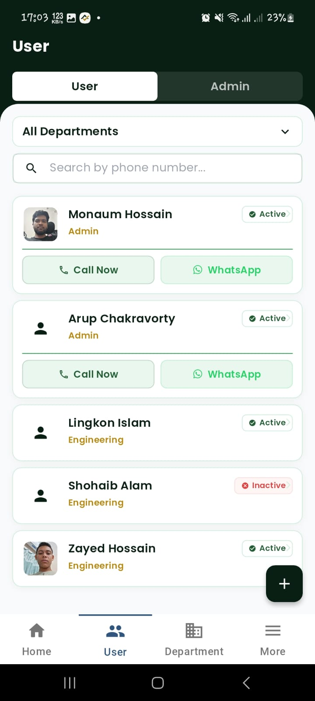
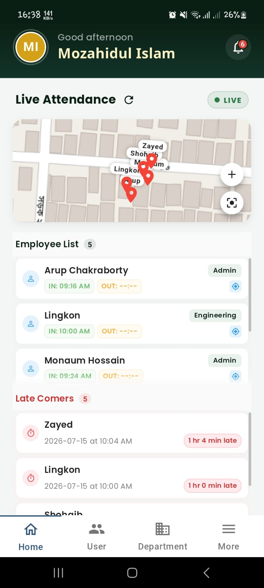
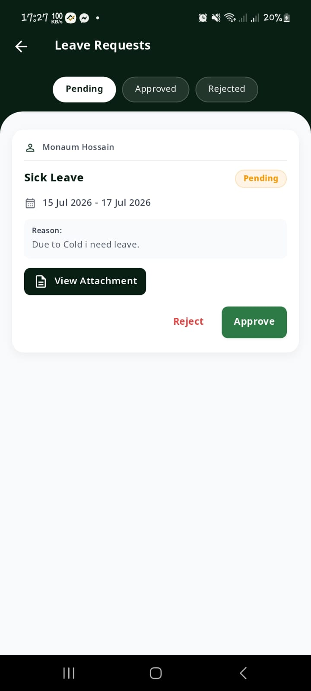

# Attendace — Smart Attendance, Simplified
**Attendance that runs itself. Security you can trust.**

---

## Overview
Manual attendance registers and buddy-punching are things of the past. **Attendace** uses real-time GPS and layered authentication to mark attendance automatically, accurately, and fraud-free.

---

## 🚀 Key Features

### 📍 Automatic GPS Attendance
The moment an employee enters their assigned 100-meter geofenced work location, they're marked present — no manual clock-in. First GPS entry of the day becomes check-in; last exit becomes check-out.

### 🔐 Two-Factor Authentication (2FA)
Every login is protected by password plus a one-time code (SMS, email, or authenticator app), so only verified employees can access the system.

### 📊 Real-Time Tracking
Live location capture throughout work hours logs every movement with a timestamp — giving full visibility with zero manual entry.

### ⚠️ Smart Late Alerts
Late arrivals are flagged automatically. The system tracks monthly and consecutive late patterns and alerts supervisors before occasional tardiness becomes a habit.

### 🔔 Instant Notifications
From the first employee arriving each day to leave approvals and location changes, employees and supervisors are notified automatically and in real time.
.jpeg)

### 📅 Digital Leave Management
Employees apply for leave with supporting documents in a few taps; supervisors approve directly from their dashboard.

### 🔍 Powerful Search & Reporting
Find any employee instantly by name, designation, or number. Generate attendance, performance, habitual latecomer, and movement reports on demand.

### 🛡️ Enterprise-Grade Security
All location data is encrypted and transmitted over SSL/TLS. Employee consent is recorded, transparent, and always revocable.

---

## 🎨 Design Excellence
Our app follows a professional **Deep Forest Green (#0A1F13)** and **Golden Accent (#D4A017)** theme, ensuring a modern and clean user experience.

---

**CTA:** Attendace gives HR and management one reliable source of truth for attendance — automatic, accurate, and audit-ready from day one.
